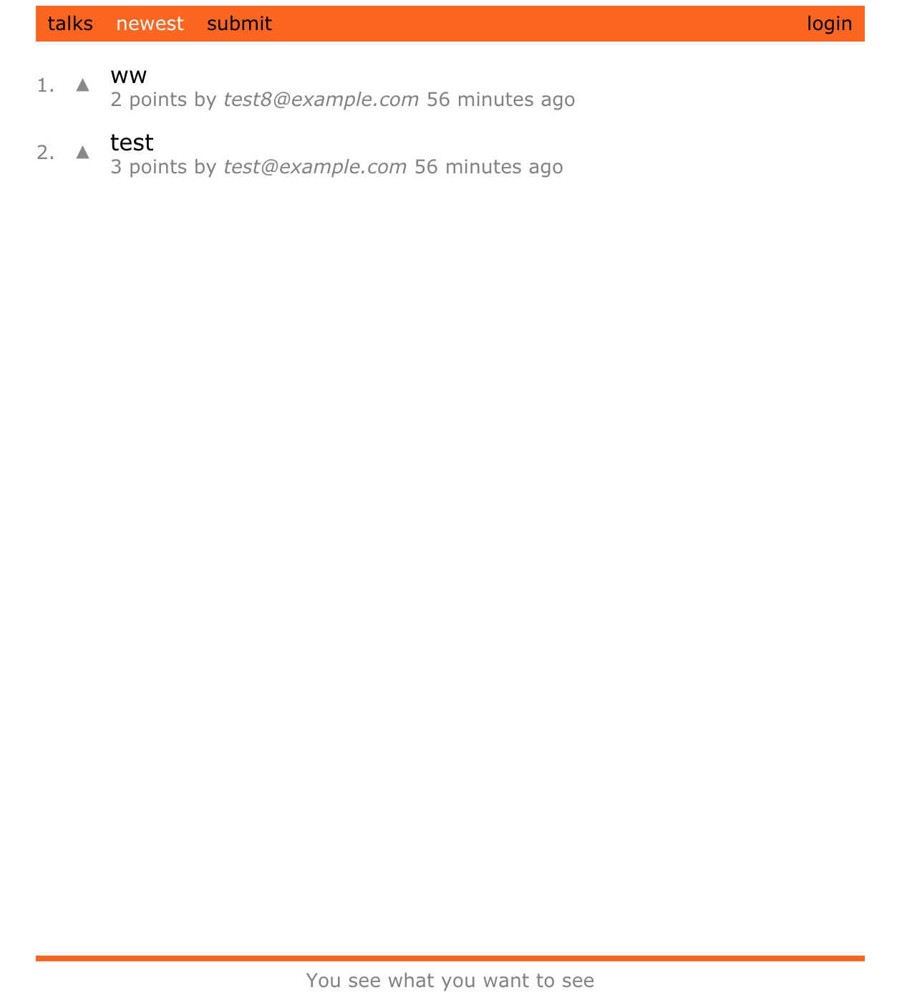

## NOTE
According to the requirements, there are some tech stack constraints, which should be taken into consideration.

## Tech Stack
`Loopback` is strong at quick exposing of REST API based on model definitions, also include ACL support, unified database connector methods and API explorer.

Which seems good at glance, but for most simple and heavy projects, it just doesn't fit as the best. Which can be handled more elegant, quick and controllable.

`Seneca` as a micro service builder, has a lot of problems, lack of complete and consistent docs, continuous inactivity, specifically designed for NodeJS, which means coupled with languages.

Above things in mind and tech constraints(with Loopback), using:
 
* Vue, Vue-Router for frontend
* Loopback, MongoDB for backend

## How to run
* reading server/README.md, run backend service
* reading client/README.md, run client service

## Screenshot

## TODO
#### Frontend
* Robust logging method for FE other than just alert  
* For libs/api should be managed by npm like system, and need test coverage

#### Backend
* Restful API, not just using built-in so called REST like exposed API  
* Unit test coverage  
* Deployment related settings and tool suite

